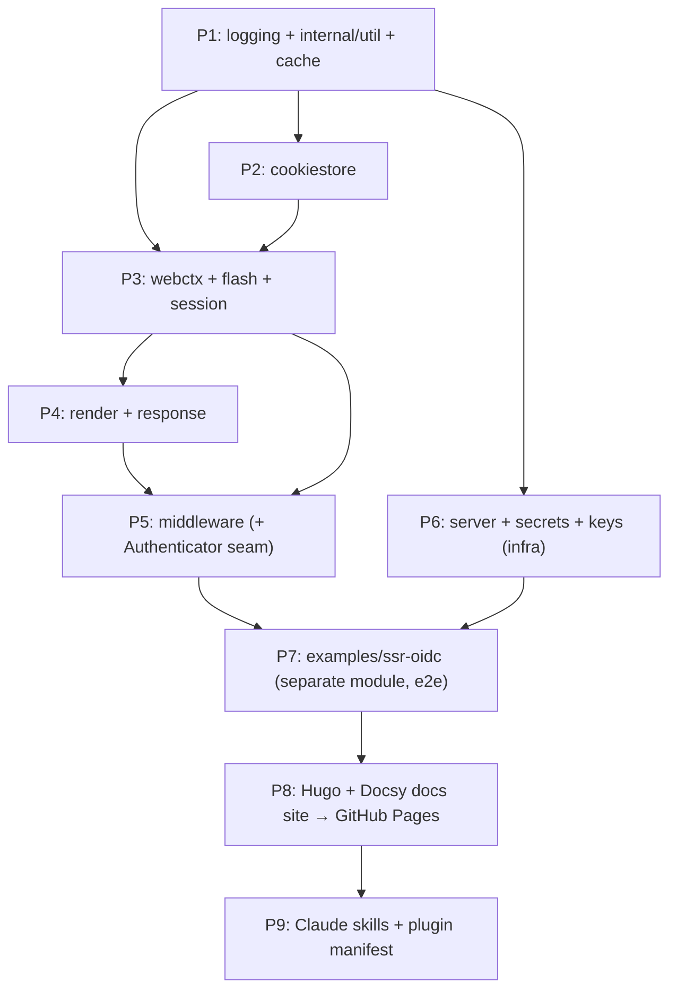

# go-bananas — Implementation Plan

> The application framework for Go that is so simple, it's Bananas. A lean SSR web core
> (renderer + middleware + security plugins) with a pluggable `Authenticator` seam, plus an
> app-infra layer (graceful HTTP server, pluggable secrets/keys, generic cache). Extracted
> from Google's `exposure-notifications-verification-server` (ENVS) and
> `exposure-notifications-server` (ENS).

## Context

`github.com/mikehelmick/go-bananas` is a clean slate today (`pkg/test/` + a golangci-lint
tooling block in `go.mod`, `go 1.26`). ENVS grew a reusable SSR framework (template renderer
with rich FuncMap + SRI asset tags, composable `gorilla/mux` middleware, CSRF, secure-cookie
sessions, flash messages, typed request-context helpers) but welded to domain concerns (DB
models, Firebase, `pkg/rbac`, zap, `internal/project`/`internal/i18n`). ENS has the matching
infra layer (`server`, `secrets`, `keys`, `cache`). This project extracts the generic,
domain-free pieces into flat top-level packages, swaps zap → stdlib `log/slog`, and keeps
cloud SDKs opt-in via self-registering sub-packages.

**Local source roots (port FROM these — present on this machine):**
- ENVS: `/Users/mhelmick/go/src/github.com/google/exposure-notifications-verification-server`
- ENS:  `/Users/mhelmick/go/src/github.com/google/exposure-notifications-server`

**Target:** `/Users/mhelmick/go/src/github.com/mikehelmick/go-bananas` (this repo).
**Go:** 1.26.3 — slog, generics, `errors.Join` all available. No version bump.

## Cross-cutting requirement: documentation is first-class

Go documentation is **not** an afterthought — it is a deliverable of every phase:
- **Every package** gets a package-level doc comment (a `doc.go` for non-trivial packages)
  explaining purpose, the main types, and a short usage orientation.
- **Every exported identifier** (type, func, method, const, var) gets a complete doc comment
  in standard godoc form (starts with the identifier name).
- **Runnable testable examples** (`func Example...`, `func ExampleType_Method...`) in
  `_test.go` files for the headline APIs (`render.New`, the middleware chain, `Authenticator`,
  `secrets`/`keys` registries, `cache`). These render on pkg.go.dev **and** are verified by
  `go test`, so they cannot rot.
- A module-root `doc.go` giving the 30-second overview + a map of the packages.
- `gofmt`/`go vet` clean; doc comments wrapped sensibly. Verify with
  `go doc ./<pkg>` spot-checks and `go test ./... -run Example`.

## Module & repo layout

```
go-bananas/                         module github.com/mikehelmick/go-bananas  (go 1.26)
├── doc.go                          package overview (godoc landing)
├── logging/  internal/util/  cache/
├── cookiestore/  webctx/  flash/  session/
├── render/  response/  middleware/
├── server/
├── secrets/      (core: interfaces, registry, Resolver, cacher, filesystem, inmem)
│   ├── gcp/  aws/  azure/  vault/      ← opt-in, self-registering (own cloud deps)
├── keys/         (core: interfaces, registry, ecdsa_pem, filesystem)
│   ├── gcp/  aws/  azure/  vault/      ← opt-in, self-registering
├── examples/
│   └── ssr-oidc/                   SEPARATE MODULE (own go.mod, replace → ../..)
│       ├── go.mod                  brings in OIDC + filesystem providers, NOT in core
│       ├── main.go  templates/  static/
│       └── e2e_test.go             httptest end-to-end
├── docs/                           Hugo + Docsy site (GitHub Pages)  [Phase 8]
├── .claude/skills/                 framework skills  [Phase 9]
├── .claude-plugin/marketplace.json plugin packaging  [Phase 9]
└── .github/workflows/              ci.yml (existing) + pages.yml (Phase 8)
```

The example being a **separate module** is the key isolation guarantee: OIDC
(`golang.org/x/oauth2`, `coreos/go-oidc/v3`) and any cloud provider deps live in the
example's go.mod via a `replace github.com/mikehelmick/go-bananas => ../..`, so the core
module's dependency graph stays minimal. CI runs core `go test ./...` separately from
`cd examples/ssr-oidc && go test ./...`.

## Build order



Each code phase must `go build ./...` + `go test ./...` green (incl. `Example` tests) before
the next.

## Decisions (locked)

- **Scope:** lean SSR core + ENS infra. Exclude DB/Firebase middleware (`RequireAuth`,
  `RequireAPIKey`, `RequireMembership`, `RequireMFA`, `ProcessFirewall`, `ProcessChaff`,
  `LoadDynamicTranslations`) and ENS `observability`(OpenCensus)/`database`(Postgres).
- **Cloud deps:** opt-in self-registering sub-packages; core ships interface +
  `filesystem`/`inmem` only.
- **Logging:** stdlib `log/slog`. Don't add zap/multierr/atomic as runtime deps (leave the
  `// indirect` tooling block untouched). Use `errors.Join` (no `hashicorp/go-multierror`).
- **Layout:** flat top-level packages. Example app is a separate module.
- **i18n:** keep gotext `t`/`tDefault` in the renderer FuncMap; drop the domain `rbac` entry
  (callers re-add via `WithFuncs`); `ProcessLocale` uses a generic `LocaleProvider` seam.
- **Docs site:** Hugo + Docsy, deployed to GitHub Pages via Actions.
- **Skills:** repo-local `.claude/skills/` + `.claude-plugin/marketplace.json` for `/plugin`
  distribution.

## Source → target map

| New package | Ported from (under the local source roots) | Notes |
|---|---|---|
| `logging/` | new, replaces ENS `pkg/logging` | slog-backed; Design §1 |
| `internal/util/` | ENVS `internal/project/{random,trim,transport}.go` + ENS `pkg/{base64util,timeutils}` | drop `Root`/`DevMode`/`PasswordSentinel` |
| `cache/` | ENS `pkg/cache/cache.go` | **verbatim** — `Cache[T]`, zero deps |
| `cookiestore/` | ENVS `pkg/cookiestore/{codec,cookiestore}.go` | near-verbatim (gorilla only) |
| `webctx/` | generic subset of ENVS `pkg/controller/context.go` | Session, TemplateMap(+`.Title()`), Nonce, RequestID, TraceID, Locale, OS, Principal. Exclude User/Realm/Membership/AuthorizedApp/FirebaseUser |
| `flash/` | ENVS `pkg/controller/flash/flash.go` | verbatim |
| `session/` | generic subset of ENVS `pkg/controller/session.go` + `flash.go` | CSRFToken, LastActivity, Nonce, Region + `Flash(session)`. Drop APIKey/Realm/MFA/Email/Welcome/PasswordExpire |
| `render/` | ENVS `pkg/render/{renderer,assets,html,json,csv}.go` | Option/FuncMap refactor, Design §2 |
| `response/` | ENVS `pkg/controller/controller.go` error helpers + `content_type.go` | `InternalError`, `Unauthorized`, `BadRequest`, `NotFound`, `MissingSession`, `Back`, `RealHostFromRequest`. Drop domain redirects |
| `middleware/` | generic subset of ENVS `pkg/controller/middleware/*` | Design §3–5 |
| `server/` | ENS `pkg/server/server.go` | decouple ochttp + DB + gRPC, Design §6 |
| `secrets/` (+`{gcp,aws,azure,vault}/`) | ENS `pkg/secrets/*` | core = interfaces+registry+`Resolver`+cacher+`filesystem`+`inmem` |
| `keys/` (+`{gcp,aws,azure,vault}/`) | ENS `pkg/keys/*` | core = interfaces+registry+ECDSA PEM+`filesystem` |
| `examples/ssr-oidc/` | new (separate module) | runnable SSR demo + e2e; OIDC `Authenticator`; entropy from secrets/keys |

### Middleware included (generic)
`secure.go`(SecureHeaders), `csrf.go`, `sessions.go`(RequireSession/RequireNamedSession/
CheckSessionIdleNoAuth + `beforeFirstByteWriter`), `recovery.go`, `request_id.go`,
`trace_id.go`, `logger.go`(PopulateLogger), `gzip.go`, `current_path.go`(InjectCurrentPath),
`debug.go`, `method.go`(MutateMethod), `host_header.go`, `header.go`, `enabled.go`
(OnlyIfEnabled), `template.go`(PopulateTemplateVariables), `nonce.go`(ProcessNonce),
`operating_system.go`(AddOperatingSystemFromUserAgent — `database.OSType` → `webctx.OS`),
`i18n.go`(ProcessLocale only — Design §5), plus new `auth.go`(`Authenticator` +
`RequireAuthenticated`). **Exclude** `membership.go`, `mfa.go`, `apikey.go`, `chaff.go`,
`firewall.go`, `email_verified.go`, `observability.go`, `static.go`, `query_inject.go`, the
DB-coupled `auth.go`/`LoadDynamicTranslations`.

## Key design points

### 1. `logging/` (slog)
```go
func WithLogger(ctx, *slog.Logger) context.Context
func FromContext(ctx) *slog.Logger          // DefaultLogger() if absent
func DefaultLogger() *slog.Logger            // once, from env
func NewLogger(level slog.Level, development bool) *slog.Logger  // JSON(prod)/Text(dev)
func NewLoggerFromEnv() *slog.Logger         // parses LOG_LEVEL / LOG_MODE
func Named(l *slog.Logger, name string) *slog.Logger   // l.With("logger", name)
func TestLogger(tb testing.TB) *slog.Logger
```
Call-site translation (every ported file): `.Named("x")` → `logging.Named(l,"x")`;
`Errorw/Infow/Warnw/Debugw(msg, "k", v)` → `Error/Info/Warn/Debug(msg, "k", v)` (1:1);
printf `Debugf("…")` → `Debug("…")` (slog has no printf form); `beforeFirstByteWriter.logger`
& `PopulateLogger` param become `*slog.Logger`. Drop GCP `logging.googleapis.com/trace`
coupling (keep request-id enrichment generic).

### 2. `render/` Option/FuncMap refactor
```go
type Option func(*Renderer)
func WithDevMode(bool) Option
func WithLogger(*slog.Logger) Option
func WithBuildID(string) Option              // replaces internal/buildinfo global
func WithFuncs(htmltemplate.FuncMap) Option  // merged OVER defaults
func WithTextFuncs(texttemplate.FuncMap) Option
func New(fsys fs.FS, opts ...Option) (*Renderer, error)   // drop ctx; logger via option
```
Keep generic helpers + gotext `t`/`tDefault`. Drop `"rbac"` & `"passwordSentinel"` FuncMap
entries; `trimSpace` → `internal/util.TrimSpace`. `csv.go`: local
`type CSVMarshaler interface { MarshalCSV() ([]byte, error) }`. `assets.go`: thread `BuildID`
from option; **fix the latent bug** — `jsIncludeTagCache`/`cssIncludeTagCache` are package
globals shared across Renderers (assets.go:43,53); move to per-`Renderer` fields. Keep
`static/js`/`static/css`.

### 3. Pluggable auth seam (`middleware/auth.go`, new)
```go
type Authenticator interface {
    Authenticate(r *http.Request) (principal any, err error)  // (nil,nil) = anonymous
}
func RequireAuthenticated(a Authenticator, h *render.Renderer) mux.MiddlewareFunc
// webctx: WithPrincipal(ctx, p) / PrincipalFromContext(ctx) any
```
error → `response.InternalError`; nil principal → `response.Unauthorized`; else
`WithPrincipal` + continue. Concrete OIDC `Authenticator` lives ONLY in the example module.

### 4. Session-idle decoupling
`CheckSessionIdleNoAuth(h *render.Renderer, idleTTL time.Duration, onIdle http.HandlerFunc)`
— caller supplies the idle handler (replaces domain `RedirectToLogout`). `response/` offers a
simple 303-to-path helper.

### 5. i18n / `ProcessLocale` seam
```go
type LocaleProvider interface {
    Lookup(hints ...string) (t gotext.Translator, lang string)
}
func ProcessLocale(p LocaleProvider) mux.MiddlewareFunc
```
Keep template-map population (`locale`, `acceptLanguage`, `textDirection`, `textLanguage`) +
RTL set. Drop `internal/i18n` and `LoadDynamicTranslations`. Example ships a trivial
gotext-backed provider.

### 6. Infra layer (ENS)
- **`server/`**: keep `New`/`NewFromListener`/`ServeHTTP`/`ServeHTTPHandler`/`Addr`/`IP`/
  `Port`. Drop `ochttp` wrap, `ServeMetricsIfPrometheus`, `ServeGRPC`, `healthz.go`,
  `metrics.go`. `errors.Join` for shutdown aggregation. Swap logging; rewrite `Debugf`.
- **`secrets/`**: port `SecretManager`/`SecretVersionManager`, `Config`, registry
  (`RegisterManager`/`SecretManagerFor` keyed on `Config.Type`), `Resolver`
  (`sethvargo/go-envconfig` mutator), cacher (back with `cache.Cache[string]`),
  `filesystem`+`in_memory` into core. Cloud files → `secrets/<provider>/` self-registering.
- **`keys/`**: port `KeyManager`/`SigningKeyManager`/`EncryptionKeyManager`/version
  creator+destroyer, registry (`KeyManagerFor`), `ecdsa_pem.go`, `filesystem` into core
  (keep `crypto.Signer`). Cloud → `keys/<provider>/`. `testing.go` → core test helper.

### 7. Core `go.mod`
Add runtime: `gorilla/mux`, `gorilla/sessions`, `gorilla/securecookie`, `unrolled/secure`,
`NYTimes/gziphandler`, `google/uuid`, `dustin/go-humanize`, `leonelquinteros/gotext`,
`sethvargo/go-envconfig`. Opt-in cloud (declared, compiled only when a provider sub-pkg is
blank-imported): GCP `cloud.google.com/go/{secretmanager,kms}` + `sethvargo/go-gcpkms`; AWS
`aws/aws-sdk-go`; Azure `Azure/azure-sdk-for-go`; Vault `hashicorp/vault/api`. Don't add:
zap/multierr/atomic, firebase, grpc, OpenCensus, database/rbac/buildinfo/icsv. Leave the
existing `// indirect` golangci block untouched. OIDC deps live only in the example module.

## Phases

**P1 — `logging/` + `internal/util/` + `cache/`** (no internal deps). slog logging (§1) +
`TestLogger`; util helpers; `cache.go` verbatim. Tests: `cache_test.go` + logging + util.
Docs: `doc.go` per pkg, `Example` for `cache` + `logging`.

**P2 — `cookiestore/`** — verbatim `codec.go`/`cookiestore.go`/`codec_test.go`. Doc comments
+ `Example` for the `HotCodec`/store.

**P3 — `webctx/` + `flash/` + `session/`** — `flash` verbatim; generic context subset (add
`OS` type + `Principal` accessors); generic session accessors. Tests: `flash_test.go` +
trimmed `context_test`. Docs: package docs + accessor comments.

**P4 — `render/` + `response/`** — Option/FuncMap refactor (§2); per-Renderer asset cache +
`WithBuildID`; csv/CSVMarshaler swap; error helpers. Tests: `renderer`/`html`/`json` +
embedded-FS SRI test + per-Renderer cache-isolation test. Docs: `doc.go` with a full
"render an HTML page" `Example`.

**P5 — `middleware/`** — generic subset; `OSType`→`webctx.OS`; logging translation (§1);
`CheckSessionIdleNoAuth` onIdle (§4); `ProcessLocale` `LocaleProvider` (§5); new `auth.go`
(§3). Tests: csrf, sessions, recovery, request_id, trace_id, header, method, current_path,
debug, operating_system, i18n + `RequireAuthenticated` happy/anon/error. Docs: a
chain-assembly `Example` showing recommended middleware order.

**P6 — `server/` + `secrets/` + `keys/`** — decoupled `server` (§6); secrets core then each
`secrets/<provider>/`; keys core then each `keys/<provider>/`. Tests: filesystem/inmem
round-trips (no creds); cloud tests build-tag/env guarded. `go test ./...` green; cloud
sub-pkgs compile-checked. Docs: registry `Example` (register + look up a provider).

**P7 — `examples/ssr-oidc/` (separate module)** — own `go.mod` with
`replace … => ../..`, OIDC (`x/oauth2` + `go-oidc/v3`), filesystem secrets/keys. Full chain
(Recovery → PopulateRequestID → PopulateTraceID → PopulateLogger → SecureHeaders →
GzipResponse → RequireSession → HandleCSRF → PopulateTemplateVariables → InjectCurrentPath)
via `server.ServeHTTPHandler`; `embed.FS` templates + `static/js|css`; HTML+JSON routes,
CSRF-protected form, flash, OIDC `Authenticator`, `cookiestore.EntropyFunc` from a secrets/
keys manager. `e2e_test.go` (httptest). A `README.md` walking through it.

**P8 — Hugo + Docsy docs site → GitHub Pages.** `docs/` Hugo project (Docsy via Hugo
modules), `hugo.toml`, `content/_index.md`, guides (getting-started, middleware-chain,
rendering-templates, sessions-and-csrf, authenticator-oidc, secrets-and-keys, server, cache),
and a reference section that links to pkg.go.dev for API docs. `.github/workflows/pages.yml`
(setup-hugo + Node for Docsy postcss → build → deploy-pages). Enable Pages (Actions source).
Landing page mirrors README; each guide cross-links the matching `Example` on pkg.go.dev.

**P9 — Claude skills + plugin manifest.** `.claude/skills/<name>/SKILL.md` for:
`go-bananas-scaffold` (new SSR app skeleton wired to the recommended chain),
`go-bananas-middleware` (add/order middleware), `go-bananas-auth` (implement an
`Authenticator`, incl. OIDC), `go-bananas-secrets` (choose + register a secrets/keys
provider). Each skill links the docs site + pkg.go.dev and embeds copy-paste snippets drawn
from the verified `Example` tests. `.claude-plugin/marketplace.json` + plugin dir so users
can `/plugin marketplace add mikehelmick/go-bananas` and install.

## Verification

- **Per phase:** `go build ./... && go test ./...` green, including `go test ./... -run
  Example`. `go vet ./...` clean. Spot-check `go doc ./<pkg>` for completeness.
- **New-seam tests:** `WithFuncs` override/merge; `WithBuildID` cache-busting; per-Renderer
  asset-cache isolation (guards the fixed global-cache bug); `RequireAuthenticated`
  happy/anonymous/error; `ProcessLocale` with a fake provider; `CheckSessionIdleNoAuth` fires
  `onIdle` past TTL.
- **Opt-in isolation:** `go list -deps ./secrets/... | grep cloud.google.com` returns nothing
  for a consumer importing only `secrets` (not `secrets/gcp`); cloud sub-pkgs still build.
  `server` graceful-shutdown test via `context` cancel + `errors.Join`.
- **Example module (separate):** `cd examples/ssr-oidc && go build ./... && go test ./...` —
  httptest e2e: GET renders HTML with CSRF `<meta>`; POST without token → 401; POST with
  token → 200; redirect flash appears once then clears. `go run .` + `curl -I` confirms
  secure headers + dev-mode hot-reload.
- **Docs:** `cd docs && hugo --minify` builds clean locally; Pages workflow green; site
  reachable at the project Pages URL.
- **Skills:** each `SKILL.md` validates (frontmatter, description triggers); plugin installs
  from the marketplace manifest in a scratch session.
